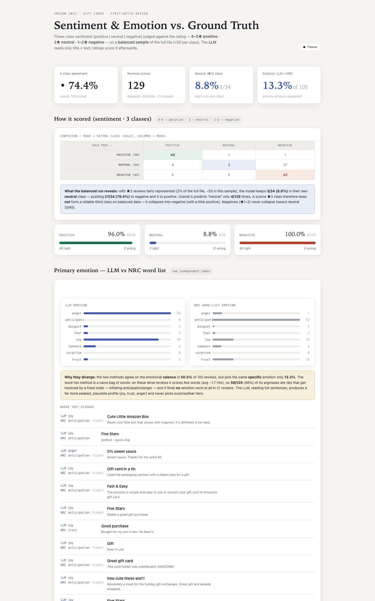
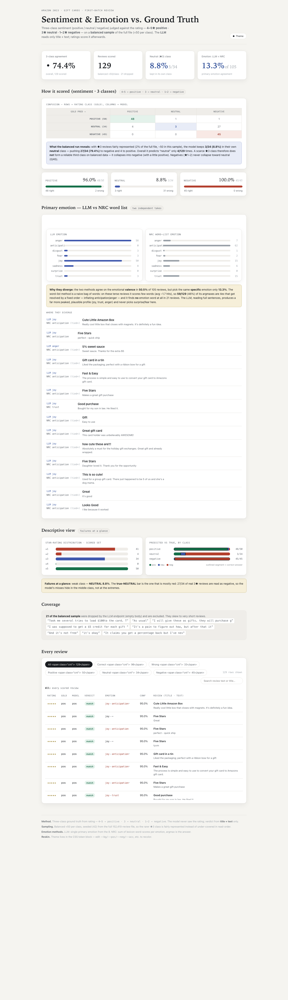

# Sentiment & Primary-Emotion Analysis of Amazon Gift Card Reviews

A small, reproducible pipeline that scores Amazon reviews for **three-class sentiment**
(positive / neutral / negative) and a **primary emotion** — using an LLM on one hand and a
rule-based **NRC word list** on the other — and renders the results in a single
self-contained, offline dashboard.

The dashboard is `dashboard.html` (open it in any browser, no server needed). Screenshots
at the bottom of this page.

---

## Data

**Amazon Reviews '23** — Hou, Y., Li, J., He, Z., Yan, A., Chen, X., & McAuley, J. (2024),
*Amazon Reviews 2023*, UCSD McAuley Lab.
Official site: <https://amazon-reviews-2023.github.io/>

We use the **Gift Cards** category of the raw review data, hosted by the McAuley Lab and
downloaded from:

```
https://mcauleylab.ucsd.edu/public_datasets/data/amazon_2023/raw/review_categories/Gift_Cards.jsonl.gz
```

That file holds **152,410 review records**, each with `title`, `text`, `rating`, `user_id`,
`timestamp`, `asin`, and `verified_purchase`. The rating is used only to score the model
afterwards — it is never shown to the LLM, which sees only `title` + `text`.

---

## Setup & reproduce

```bash
uv venv --python 3.11 .venv
uv pip install --python .venv/bin/python openai nrclex

# 1. Score a balanced sample (50 per class, seeded) + emotions with the LLM
OPENAI_API_KEY=$KEY OPENAI_BASE_URL=$URL OPENAI_MODEL=$MODEL \
  .venv/bin/python classify_reviews.py Gift_Cards.jsonl.gz \
  --out reviews_3class.jsonl --balanced 50 --seed 42 --no-json-mode --eval

# 2. Add the NRC word-list emotion offline (no model calls)
.venv/bin/python nrc_scorer.py reviews_3class.jsonl --out reviews_3class_nrc.jsonl

# 3. Build the dashboard and verify its numbers against the saved output
.venv/bin/python build_dashboard.py reviews_3class.jsonl --out dashboard.html
.venv/bin/python verify_dashboard.py dashboard.html reviews_3class.jsonl
```

---

## Working files

| File | Role |
|---|---|
| `prompt.md` | The exact LLM system prompt + request + output contract |
| `classify_reviews.py` | LLM scoring: balanced sampling, three-class sentiment + primary emotion, resumable |
| `nrc_scorer.py` | NRC word-list emotion scorer (offline) |
| `build_dashboard.py` | Generates the self-contained `dashboard.html` |
| `verify_dashboard.py` | Cross-checks the embedded/rendered numbers against the saved ground truth |
| `recompute_run.py` | Recompute every published number from the raw output — the self-check |
| `reviews_3class.jsonl` | One balanced run's raw output (129 labeled of 150) |
| `dashboard.html` | The final dashboard (works offline, themable via CSS tokens) |

---

## Results (figures from the saved run `reviews_3class.summary`)

Run: **balanced ≈50 per rating class**, seed 42, from the full 152,410-review file.
150 reviews submitted; **129 scored** (21 dropped by the LLM endpoint — see Caveats).

**Overall three-class agreement: 74.4% (96/129).**
Per-class recall (ground truth from rating: 4–5★ positive · 3★ neutral · 1–2★ negative):

| Class | Correct | Recall |
|---|---|---|
| POSITIVE (4–5★) | 48 / 50 | 96.0% |
| NEUTRAL (3★) | 3 / 34 | 8.8% |
| NEGATIVE (1–2★) | 45 / 45 | 100% |

Confusion matrix (rows = true rating class, columns = model prediction):

| gold \ pred | positive | neutral | negative |
|---|---|---|---|
| positive (50) | 48 | 1 | 1 |
| neutral (34) | 4 | 3 | **27** |
| negative (45) | 0 | 0 | 45 |

Star-rating distribution of the scored set: ★1 = 41 · ★2 = 4 · ★3 = 34 · ★4 = 0 · ★5 = 50.

Emotions (LLM vs NRC word list, over 105 reviews where both produced one):

| Metric | Value |
|---|---|
| Same primary emotion (LLM = NRC) | 14 / 105 = **13.3%** |
| Same emotional valence | 53 / 105 = **50.5%** |
| LLM primary emotions | joy 50 · anger 58 · sadness 8 · disgust 3 · fear 3 · trust 3 |
| NRC primary emotions | anticipation 62 · joy 15 · trust 15 · anger 7 · sadness 6 · fear 2 · disgust 1 |

---

## Re-check these numbers yourself

Every figure above is derived from the saved raw output `reviews_3class.jsonl` (label,
rating, text, emotion) plus the fixation that balanced sampling is deterministic (seed 42).
You can re-derive all of it without the model or the dashboard:

```bash
# Reproduce every number in this README from the raw output
python recompute_run.py reviews_3class.jsonl

# Confirm the dashboard's embedded data + filters equal that same saved output
python verify_dashboard.py dashboard.html reviews_3class.jsonl
```

`recompute_run.py` recomputes the agreement, per-class recalls, the 3×3 confusion matrix,
the star distribution, and the LLM-vs-NRC emotion comparison, and prints them — compare its
output line-by-line with the tables above. `verify_dashboard.py` must print `ALL CHECKS PASS`.

---

## Findings

### 1. Why did the lopsided run look very accurate, and what did balanced sampling change?

The full 152,410-review file is overwhelmingly positive: **134,940 (88.5%) are 4–5★**,
**14,199 (9.3%) are 1–2★**, and only **3,271 (2.1%) are 3★**.
An un- (or randomly-) sampled, mostly-positive set, judged with a **binary** positive/negative
rule, appeared to match ratings ~97% of the time. That number mostly reflected the **class
prior** — there were almost no 3-star reviews to test a middle class.

Rounding out each class to ~50 from the whole file changed the picture dramatically. The
model's real three-class agreement is **74.4%**, not ~97%. The gap is *exactly* the middle
class: fairly represented, 3-star reviews mostly come out **negative** (below).

### 2. Where do the model's mistakes go, and in which direction?

From the matrix above, the errors are **one-directional and concentrated in the middle**:

- **★3 (neutral) reviews are labeled negative:** 27 of 34 true 3★ (79%) → `negative`,
  only 3/34 (8.8%) stay `neutral`, and 4/34 → `positive`.
- **Negatives are never softened:** 0 of 45 true 1–2★ reviews are called `neutral`.
- **Positives are rarely misread:** 1/50 → `neutral`, 1/50 → `negative`.

So the model does **not** make symmetric confusions. A star-based "neutral" label does not
map to a text class the model produces: it predicts `neutral` only **4 times in 129** (~3%),
and 3-star reviews — usually mild complaints ("good but…", "works, except…") — read to the
LLM as **negative**. The miss hides in the middle class, not at the extremes.

### 3. How do the LLM's emotions and the word-list's emotions differ, and why?

They agree on the exact emotion only **13.3%** of the time, and on valence (positive- vs
negative-leaning) only **50.5%** here. The shapes are very different:

- **LLM** output is peaked and coherent — joy, anger, sadness dominate; several emotions
  (`surprise`, `anticipation`) are never picked on these reviews.
- **NRC** skews hard to **anticipation** (62/105) and its argmax is frequently arbitrary.

Why: the **NRC method is a naive bag of words**. On these terse reviews it matches only
~3.2 lexicon words per review, finds **no** emotion word at all in 21 of 129, and because NRC
maps each word to **several** emotions at once, **59 of 129 (46%) of its argmaxes are ties** —
resolved by a fixed tie-break order, inflating `anticipation` and `anger`. The **LLM**, reading
full sentences, picks a single coherent emotion and ignores the lexicon's many-to-many noise.
On this balanced set (more negative and mixed text), the word-list method is especially
unreliable, which is why valence agreement drops to ~50%.

### 4. Bugs and issues hit along the way

- **Full disk / stray Git repo.** Home directory held a runaway `~/.git` with 279 GB of
  orphaned `tmp_pack_*` files (an interrupted `git add` of the home dir). The disk was 100%
  full and blocked all work. Verified the repo had no valid commits, then removed it —
  freed ~287 GB with no loss of personal files.
- **LLM endpoint flakiness.** The LLM proxy intermittently returned HTTP 200 with an *empty
  body* (worse on very short reviews). This run dropped 21/150, and the drop hit the rare
  class hardest (only 34 of 50 → 3★ survived). Workarounds: patient retry + backoff on
  empty responses, and the scorer records 5★/scored failures as *unlabeled* rather than
  guessing.
- **`review_id` collision.** Keying reviews on `(user_id, timestamp)` collided in the full
  file (a user reviewing two products in the same millisecond), corrupting dedup/verification.
  Fixed to `(user_id, timestamp, asin)`.
- **Own verifier bugs.** An earlier version used a binary gold inline and mixed set- vs
  list-counts, producing false failures on 3-class data; rewrote it to the 3-class rule and
  consistent multiset counting.
- **Dashboard/layout.** A KPI label lost its threshold digit ("rating ≥" with no "4"); a
  class card rendered "UNDEFINED" (key-name mismatch) — both caught and fixed in the render.
  To prevent collapsed charts, zero-count star bars and zero-width segments keep a
  `min-width` stub and every count is a separate text cell, so a bar can be *zero* without
  vanishing (visible in the ★4 = 0 gap in the star distribution).
- **In-browser verification limit.** Pixel-level DOM measurement of the live page could not
  be completed fully autonomously (the external-browser tool requires approving Chrome's
  remote-debugging popup; the in-app preview driver needs the pane actively focused; and the
  active model is not multimodal). Instead, numbers are guaranteed by `verify_dashboard.py`
  (embedded data + filter logic vs saved ground truth) and screenshots below were produced
  with **headless Chrome**, a real browser render.

---

## Screenshots

Generated with headless Chrome (real JS render of `dashboard.html`).

**Top of the dashboard — KPIs, 3×3 confusion matrix, per-class recall:**



**Full-page capture — includes the emotion comparison and descriptive view:**



---

## Caveats

- Ratings are a **noisy proxy** for text sentiment: the few "errors" on 4★ reviews are
  frequently 4-star text that reads negative (e.g., "Product was not what I expected.").
- The balanced sample's positive bucket drew only 5★ reviews (★4 = 0 in the distribution).
- Endpoint drops bias toward the rare class, so the ★3 conclusions rest on 34 labeled rows —
  but the collapse to `negative` (27/34) is too lopsided to be an artifact.
